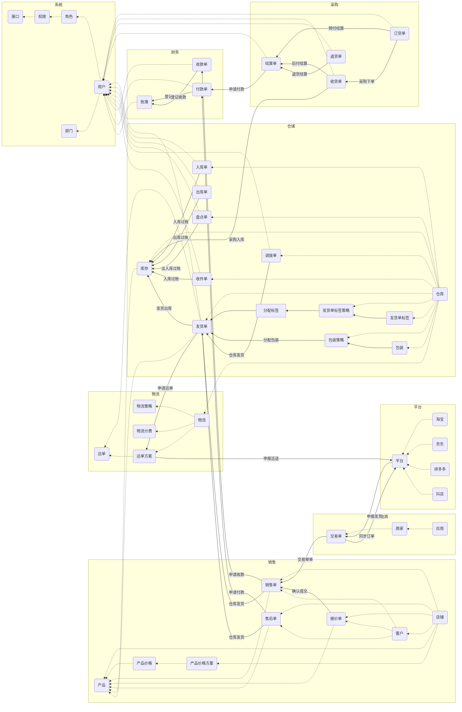

# 业务流程
> 带您了解各业务流程

```mermaid
graph RL

subgraph 平台
	taobao(淘宝)
	jingdong(京东)
	pinduoduo(拼多多)
	doudian(抖店)
	platform(平台)

	taobao -.-> platform
	jingdong -.-> platform
	pinduoduo -.-> platform
	doudian -.-> platform

end

subgraph 电商
	app(应用)
	merchant(商家)
	trade(交易单)

	app -.-> merchant
	merchant -.-> trade
	platform -- 同步订单 --> trade
end

subgraph 销售
	shop(店铺)
	product(产品)
	client(客户)
	product_price(产品价格)
	product_price_strategy(产品价格方案)
	sale(销售单)
	quote(报价单)
	aftersale(售后单)

	shop -.-> product
	shop -.-> client
	shop -.-> sale
	shop -.-> quote
	shop -.-> aftersale
	shop -.-> product_price_strategy

	product_price_strategy -.-> product_price
	product_price -.-> product

	trade -- 交易审单 --> sale
	quote -- 确认成交 --> sale
	trade -- 申报发货 --> platform

	sale -.-> product
	quote -.-> product
	aftersale -.-> product

	client -.-> sale
	client -.-> quote
	client -.-> aftersale
end

subgraph 采购
	ordering(订货单)
	receipt(收货单)
	return(退货单) 
	bill(结算单)

	ordering -- 采购下单 --> receipt
	ordering -- 预付结算 --> bill
	receipt -- 后付结算 --> bill
	return -- 退货结算 --> bill
end

subgraph 仓储
	warehouse(仓库)
	inventory(库存)
	delivery(发货单)
	delivery_tag(发货单标签)
	delivery_tag_strategy(发货单标签策略)
	pack(包装)
	pack_strategy(包装策略)
	inbound(入库单)
	outbound(出库单)
	counting(盘点单) 
	transfer(调拨单)
	recipient(收件单)

	warehouse -.-> inventory
	warehouse -.-> delivery
	warehouse -.-> delivery_tag
	warehouse -.-> delivery_tag_strategy
	warehouse -.-> pack
	warehouse -.-> pack_strategy
	warehouse -.-> inbound
	warehouse -.-> counting
	warehouse -.-> transfer
	warehouse -.-> recipient

	inventory -.-> product
	delivery -.-> product


	delivery_tag --> delivery_tag_strategy --> 分配标签 --> delivery
	pack --> pack_strategy -- 分配包装 --> delivery
	sale -- 仓库发货 --> delivery
	aftersale -- 仓库发货 --> delivery
	transfer -- 仓库发货 --> delivery
	receipt -- 采购入库 --> inventory
	inbound -- 入库过账 --> inventory
	outbound -- 出库过账 --> inventory
	counting -- 出入库过账--> inventory
	recipient -- 入库过账 --> inventory
	delivery -- 发货出库 --> inventory
end

subgraph 物流
	logistic(物流)
	logistic_strategy(物流策略)
	logistic_billing(物流计费)
	waybill_scheme(运单方案)
	waybill(运单)

	delivery -.-> waybill

	warehouse -.-> logistic
	logistic -.-> logistic_strategy
	logistic -.-> logistic_billing
	logistic -.-> waybill_scheme
	waybill_scheme -.-> waybill

	delivery -- 申请运单 --> waybill_scheme
	waybill_scheme -- 申报运送 --> platform
end

subgraph 财务
	receivable(收款单)
	payment(付款单)
	ledger(账簿)


	
	sale -- 申请收款 --> receivable
	bill -- 申请付款 --> payment
	aftersale -- 申请付款 --> payment
	payment -- 登记付款 --> ledger
	receivable -- 登记收款 --> ledger

end

subgraph 系统
	user(用户)
	role(角色)
	purview(权限)
	api(接口)
	department(部门)


	ordering -.-> user
	receipt -.-> user
	return -.-> user
	bill -.-> user

	delivery -.-> user
	inbound -.-> user
	outbound -.-> user
	counting -.-> user
	transfer -.-> user
	recipient -.-> user

	receivable -.-> user
	payment -.-> user
	ledger -.-> user

	user -.-> role -.-> purview -.-> api
	user -.-> department
end

```
